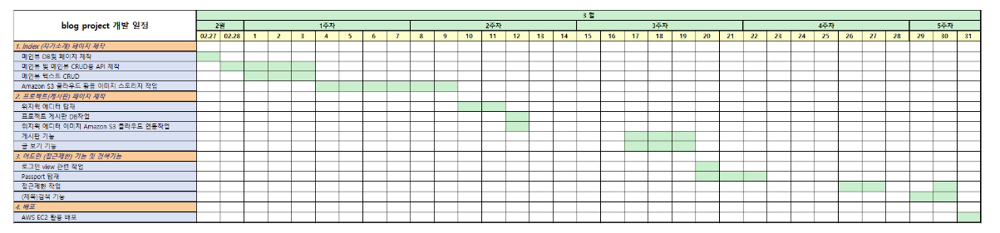

0. 아이템 선정
- 프로젝트 주제 : 사용자 `감정` 기반 영화 추천 서비스
- 이걸 왜 만들게 되었는가? : 
    1. 영화를 볼거야. 근데 뭘 볼지 모르겠어. OR 
    2. 고르는데 한 세월이야. 빨리 정하고 봐야되는데? OR 
    3. 당사자의 현재 감정이 영화를 고르는데 중요한 지표가 된다 (자료1) 이렇게 고른 영화는 만족도를 올려준다. -> 근거가 필요하다.

* 자료는 추후 검색 요망.

1. 개요
- 프로젝트 명칭 : `감정의 색`

- 개발 인원 및 기간 : 2명 11/18~11/26

- 주요 기능 : 
    1. 사용자 감정 분석 -> 동영상, 사진V -> 카메라 응시 -> 사진 10장정도 촬영 -> 감정은 7가지 -> 7가지 항목(중립 하나) -> 감정별로 영화 추천 리스트 작성 -> 감정의 퍼센테이지 만큼 영화의 비중이 바뀐다. API존재?
    2. 별점, 좋아요 기능(개인의 취향, 통계적인 것->개인정보를 확실하게 받아서 통계적으로 활용할 수 있도록.), 
    3. CRUD(문의 게시판, 댓글), 
    4. 검색?
    5. 색감 -> 몇개를 쓸건가? -> 섞일 수 있는가?(데이터를 빡세게 모아야 겠지?)
    6. 감점 분석 -> 사용자가 선택한 색감 -> 감+색 추천 
    7. 색감 뽑아내는 알고리즘? 가능할수도? API가 있는지 확인

- 기술 스택 : JS, PYTHON, VUE3, DJANGO, SQLite, Git, DevOps(가능하면,)

2. MTV / 내일

3. 간트 차트? 개발일정? 엑셀인듯?
엑셀 ? 저는 이걸 쓸 줄 몰라요.

4. API 구성 -> 백
엑셀 ? 

5. 와이어프레임(화면 설계서) -> 프론트 : 피그마, PPT

---
6. 개발 및 테스트

7. 배포?
---
8. README 및 포폴 작성

9. 회고